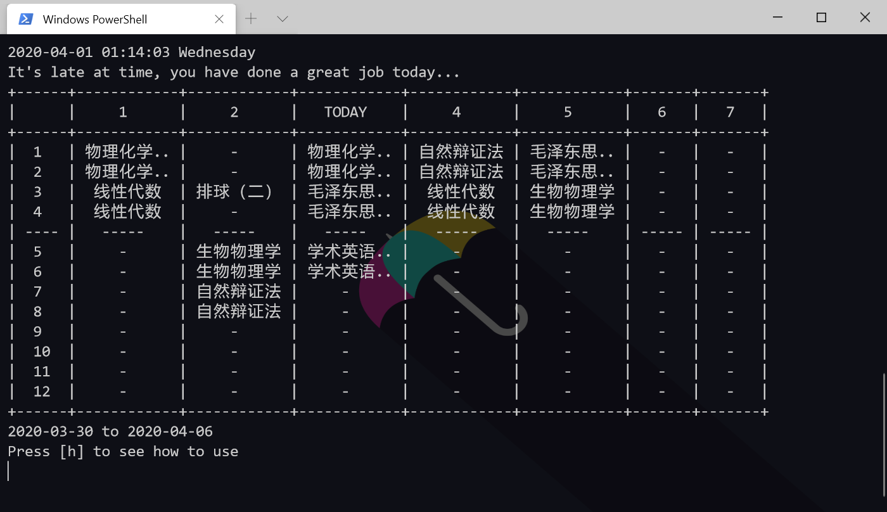
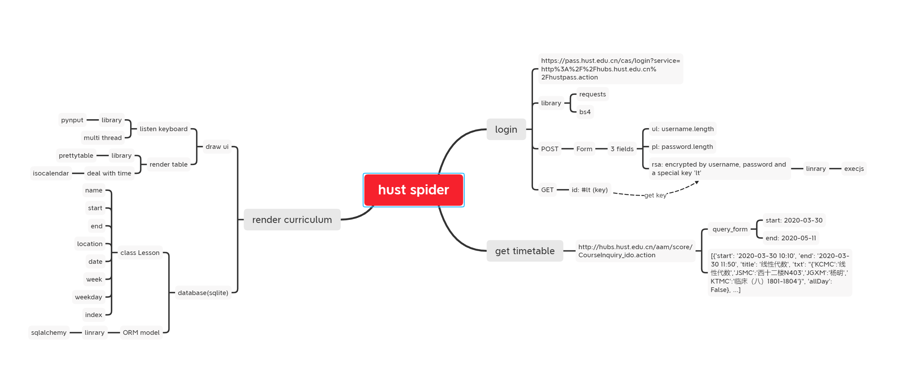
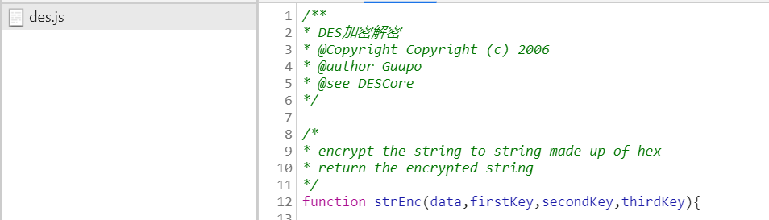
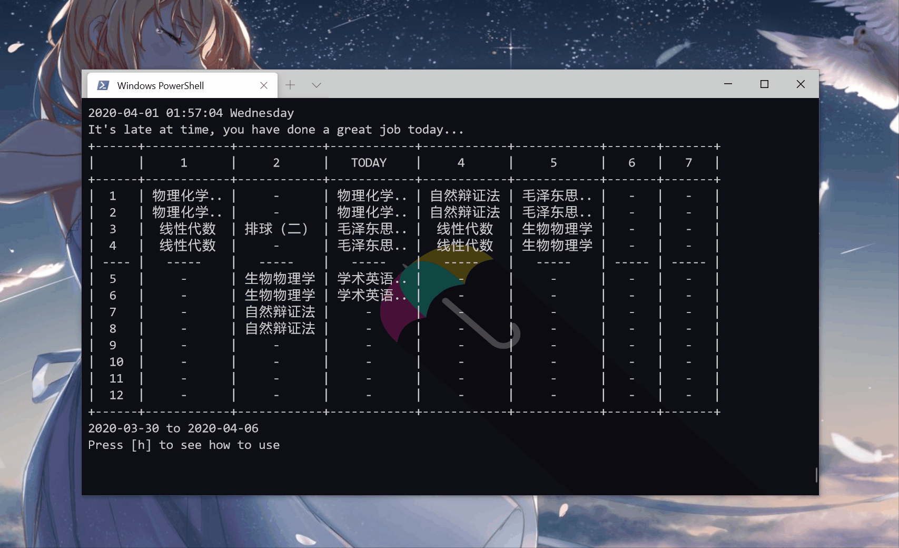

# 华中科技大学课程表

## 0 写在前面

一般看课程表都是华中大微校园的课表，但是这个企业号有时候比较坑爹，上课通知有时候没有，查询课表的时候关键时候经常打不开，或者打开很慢。而且不知是手机问题还是微信的问题，课程表有时候要点两下……至于超级课程表，花里胡哨，广告太多，还用不了。

至于教务处发的课表，**那个不是人看的**

自从上网课因为课表关系莫名其妙地 ~~翘掉一节课~~ 之后决定还是写一个爬虫把课程都爬下来，离线看比较方便，每学期同步一次即可，~~用命令行看课表也比较拉风~~。

## 1 如何使用

环境：python 3.7.4

系统：windows 10

**注意：MacOS 或 Linux 系统可能需要魔改部分代码**

1. 安装依赖

   ```python
   pip install -r requirements.txt
   ```

2. 运行

   ```
   python main.py
   ```

### 界面



本来想用 `qt` 或者 `pygame` 做个封装的，但还是这样比较拉风。

| h      | shift    | space    | left     | right    | up           | esc  |
| ------ | -------- | -------- | -------- | -------- | ------------ | ---- |
| 帮助页 | 同步课表 | 回到今天 | 前一星期 | 后一星期 | 显示上课地点 | 退出 |

建议使用 `windows terminal` 或中文支持较好的终端/字体。图示中使用的字体是 `Microsoft YaHei Mono`

## 2 实现



### 2.1 爬虫部分

基本思路：

1. 登录 [hustpass](https://pass.hust.edu.cn/cas/login?service=http%3A%2F%2Fhubs.hust.edu.cn%2Fhustpass.action) 并维持session

2. 从 [查询接口](http://hubs.hust.edu.cn/aam/score/CourseInquiry_ido.action) 查询数据

**注意：hustpass使用des加密，需要生成对应密文再进行请求**

```javascript
/*login_standar.js*/
var lt = $("#lt").val(); // salt?
	
$("#ul").val(u.length);
$("#pl").val(p.length);
$("#rsa").val(strEnc(u+p+lt , '1' , '2' , '3')); //username + password + lt
$("#loginForm")[0].submit();
```



~~比较奇怪的是des加密但表单里居然是rsa……~~


一个更简便的解决方法是使用 `selenium` ，但这种解决方案似乎不够优（ying）雅（he）。

### 2.2 存储

`sqlite3` 和 `sqlalchemy` 

保存在本地可以不用每次登录都请求一次。请求过程比较慢。

### 2.3 UI

`prettytable` 可以输出漂亮的命令行表格。但需要中文支持较好的终端/字体。

`pynput` 监听键盘事件。按向上箭头可以直接渲染得到上课地点的感觉非常爽。监听键盘会导致输入很卡……所以这个解决方案好像也不是很优雅。



显示内容有：

- 当天时间日期
- 课表
- 地点
- 根据时间显示一句鸡汤
- 当前周时间范围

## 3 结语

可参考 [从爬取华科hub教务系统课表浅谈Java信息抓取的实现](http://www.mamicode.com/info-detail-1229063.html)，`webscrab` 部分可以用 `chrome` 或其它抓包软件代替。（`wireshark` 中文支持似乎有问题？）

爬取数据之后的UI逻辑其实也很复杂，主要是返回的数据不好处理，还有冬夏时制的问题。我在实现的时候逻辑比较混乱，有更好的解决方案欢迎交流:)

**注意：这份资料里数据查询接口似乎已经失效。**

欢迎使用和交流，佛系更新。如有需要可以用 `pyinstaller` 生成一个发行版，也可以设置开机运行或者定时同步。如果有人能写一个移动版的就更好啦XD，彻底脱离微校园的苦海……如果没有人写的话我有时间也会写一个的:)

btw，愚人节快乐hhh